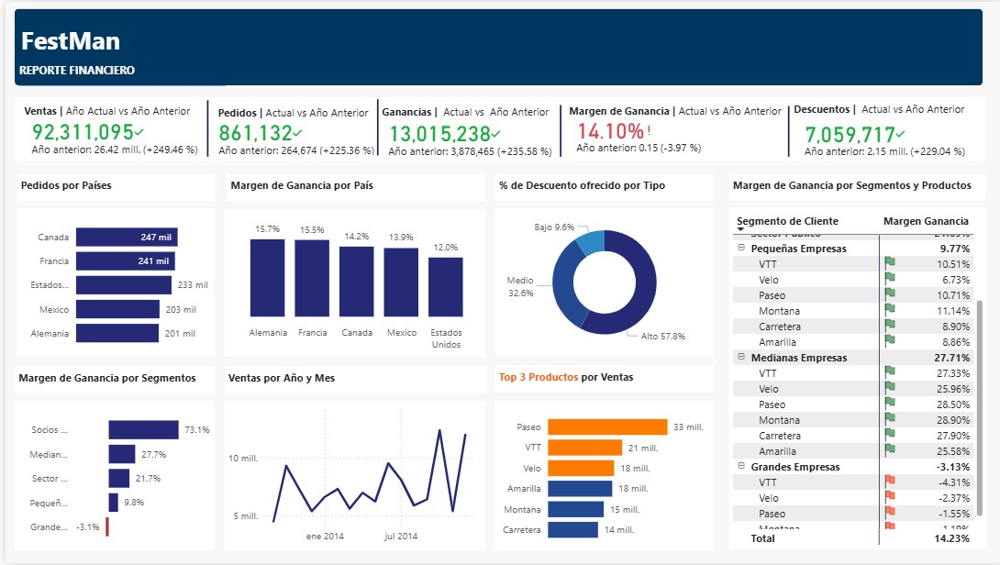

#  FestMan - Dashboard Financiero en Power BI

Este proyecto consiste en el desarrollo de un dashboard interactivo en Power BI para analizar el rendimiento financiero de la empresa **FestMan**. El objetivo es proporcionar una herramienta visual que permita tomar decisiones estratégicas basadas en datos sobre ventas, ganancias, márgenes, descuentos y comportamiento por segmentos de clientes y productos.

##  Objetivo del Proyecto

Diseñar un tablero de control financiero que permita:

- Visualizar la evolución de ventas, pedidos y ganancias.
- Analizar los márgenes de ganancia por país, segmento de cliente y producto.
- Evaluar el impacto de los descuentos en la rentabilidad.
- Identificar productos más vendidos y segmentos con desempeño negativo.

## Herramientas y Técnicas Utilizadas

###  Preparación de Datos
- **Power Query**: Limpieza, transformación y modelado de los datos. Se eliminaron duplicados, se trataron valores nulos y se crearon columnas calculadas.

###  Visualización de Datos
- **Power BI**: Creación del dashboard interactivo con visualizaciones como gráficos de barras, líneas, matrices y gráficos de anillo.

###  Cálculos DAX
- **DAX** (Data Analysis Expressions): Cálculo de KPIs como:
  - Ventas totales, ganancias y pedidos.
  - Comparaciones año contra año.
  - Margen de ganancia por segmento, producto y país.
  - Reglas de formato condicional para destacar márgenes negativos.

##  Resultados

- **Crecimiento significativo** en ventas (+249%) y pedidos (+225%) respecto al año anterior.
- **El margen de ganancia disminuyó levemente**, de 14.10% a 13.55%.
- **Canadá y Francia** lideran en número de pedidos, mientras que **Alemania y Francia** muestran los mejores márgenes.
- **El segmento de grandes empresas presenta un margen negativo (-3.13%)**, a pesar de generar un volumen considerable de pedidos, las grandes empresas no están siendo rentables para el negocio. Esto puede deberse a políticas de precios poco sostenibles, descuentos excesivos aplicados a este segmento o costos operativos elevados asociados al servicio a grandes cuentas.
- **Productos más vendidos**: Paseo (S/ 33M), VTT (S/ 21M) y Velo (S/ 18M).
- **El 57.8% de los pedidos se realizaron con descuentos altos**, lo que puede estar reduciendo la rentabilidad general.

##  Recomendaciones

1. **Revisar precios para grandes empresas**  
   Ajustar las condiciones comerciales para mejorar la rentabilidad del segmento, actualmente con margen negativo.
2. **Optimizar el uso de descuentos**  
   Limitar los descuentos altos a productos y clientes estratégicos, enfocándose en maximizar el margen de ganancia.
3. **Enfocar campañas en productos rentables**  
   Priorizar productos con alto margen y reevaluar aquellos con muchas ventas pero baja rentabilidad.
4. **Tener en cuenta estacionalidad**  
   Coordinar acciones de marketing e inventario en los periodos de mayor demanda detectados en el análisis.

##  Cómo abrir el archivo

1. Abre Power BI Desktop.
2. Carga el archivo `ReporteFest.pbix` incluido en este repositorio.
3. Explora el dashboard y ajusta los filtros para visualizar diferentes perspectivas del negocio.

## 👤 Autor

- **NicoleTello**
- https://github.com/TelloNicole

---
